# Pharmaceutical Formulation Predictive Modeling


Exploratory data analysis and machine learning pipeline for predicting drug formulation viscosity from real Design of Experiment (DoE) data collected during pharmaceutical R&D.

---

## Background

This dataset was generated from **100 real formulation experiments** conducted during pharmaceutical drug product development. Each formulation was created by varying concentrations of 4 active ingredients, 5 raw materials, water, and mixing time — a classic DoE structure. The goal is to predict **viscosity** (a critical quality attribute) from formulation inputs, enabling data-driven decisions on what to make next and reducing costly lab iterations. The data reflects real experimental noise, outliers, and the class imbalance challenges that come with small-scale pharmaceutical DoE studies.

---

## Results

### Model Accuracy Comparison
*5 models × 7 feature sets — Gradient Boosting consistently outperformed simpler regressors except for PCA only feature sets. This is due to a low number of dimensions and turning non-linear relationships into simpler linear relationships that can obscure the relationships*

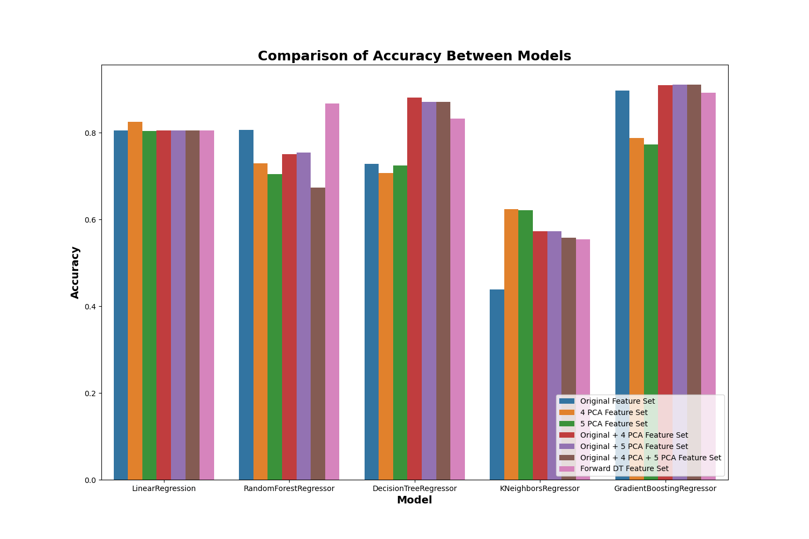

### Residual Distributions by Feature Set

| Original Features | Forward Feature Selection |
|---|---|
| 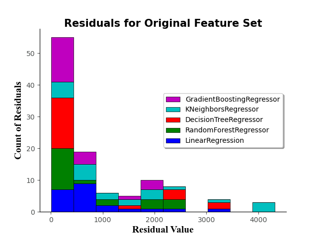 | 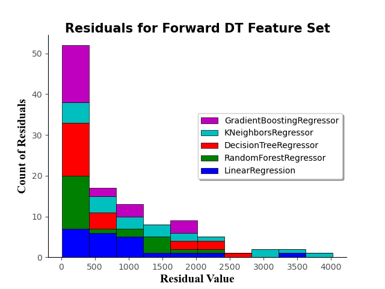 |

| 4 PCs | 5 PCs |
|---|---|
| 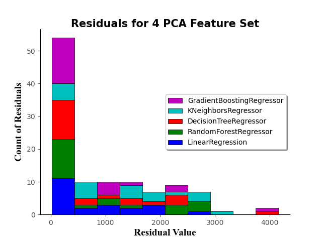 | 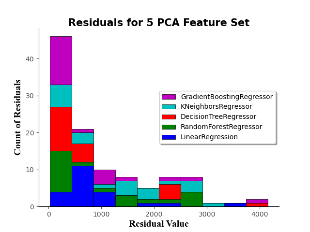 |

| Original + 4 PCs | Original + 5 PCs |
|---|---|
| 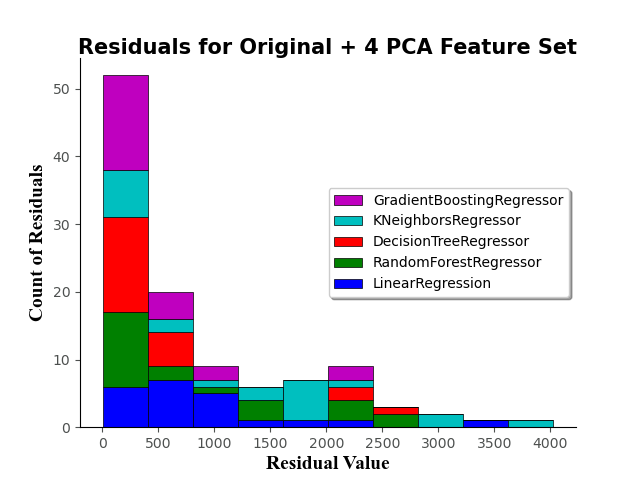 | 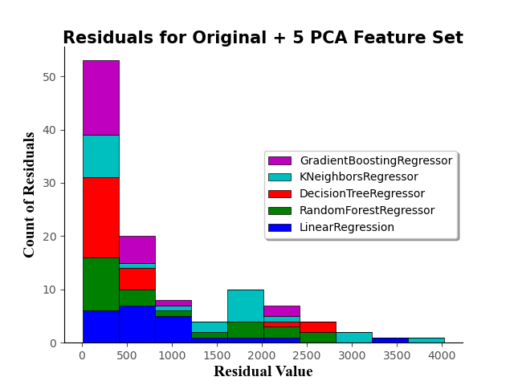 |

| Original + 4 PCs + 5 PCs |
|---|
| 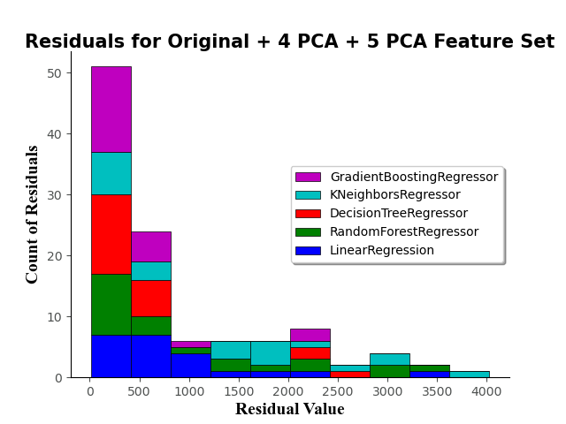 |

---

## Analytical Approach

### Data Pipeline
```
Raw DoE data (100 formulations)
    → Outlier detection & removal (R · IQR method) → 76 formulations
    → Exploratory analysis (R · corrplot, boxplots)
    → Feature engineering (Python · PCA, Forward Feature Selection)
    → Model training & cross-validation (Python · Scikit-learn)
    → Accuracy & residual comparison
```

### Feature Engineering — 7 Feature Sets
Rather than training on a single feature representation, 7 distinct feature sets were constructed and benchmarked against each other:

| Feature Set | Variables |
|---|---|
| Original | 12 raw inputs (actives, raw materials, mixing time, crashout) |
| 4 PCs | 4 principal components |
| 5 PCs | 5 principal components |
| Original + 4 PCs | 16 variables |
| Original + 5 PCs | 17 variables |
| Original + 4 PCs + 5 PCs | 22 variables |
| Forward Feature Selection | Optimal subset chosen via Decision Tree selector |

PCA component count was determined using the elbow method on explained variance — 4 components capture the dominant variance while avoiding overfitting on a small dataset.
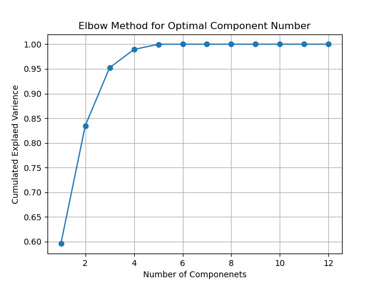

### Models Trained — 5 Regressors
Each model was trained on all 7 feature sets with a 75/25 train/test split, with discrete variable distribution checked to ensure balanced splits:

| Model | Cross-Validation |
|---|---|
| Linear Regression | None |
| Decision Tree Regressor | None |
| K-Nearest Neighbors | GridSearchCV |
| Random Forest Regressor | GridSearchCV |
| Gradient Boosting Regressor | RandomizedSearchCV |

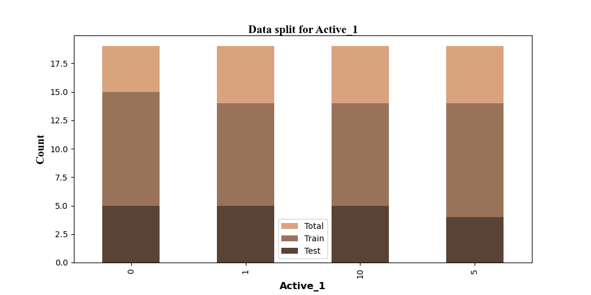
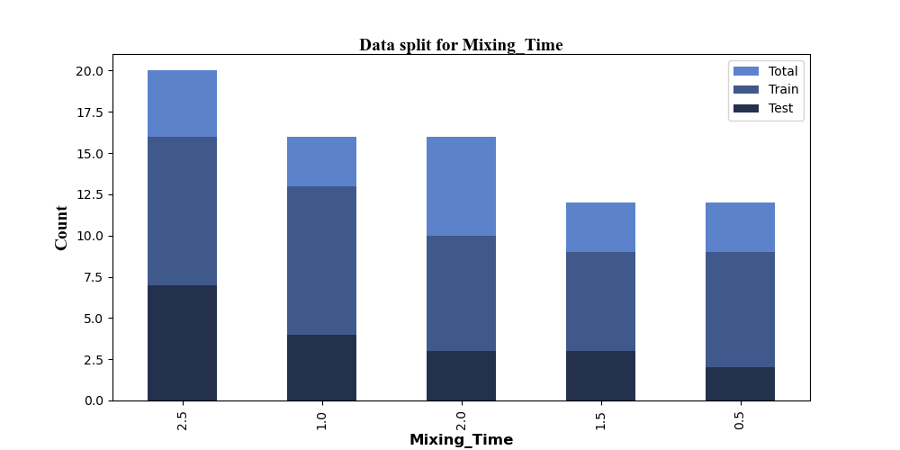

---

## Exploratory Analysis

### Outlier Detection
Box plots revealed significant outliers in the raw viscosity data — likely formulations where ingredient ratios caused out-of-range behavior. These were removed using the IQR method in R before any modeling.

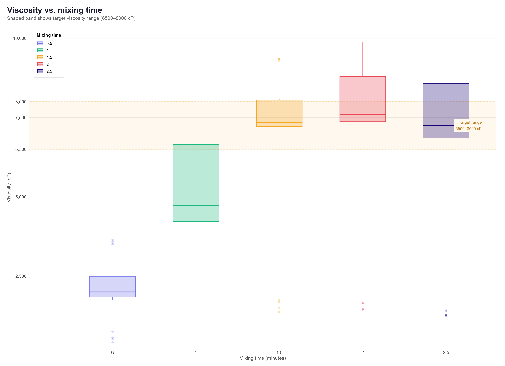
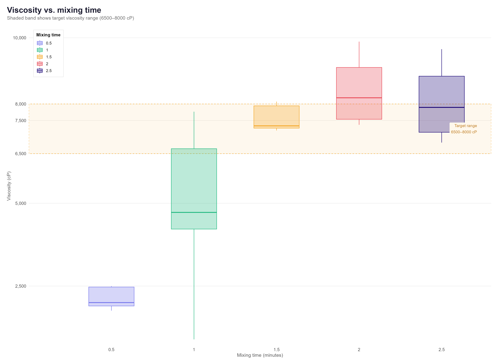

### Correlation Analysis
Key findings from the corrplot:
- Mixing time and viscosity have a strong positive correlation (0.78)
- Active 1 and viscosity have virtually no correlation (-0.01)
- Viscosity and crashout are negatively correlated (-0.48)
- Remaining raw materials co-vary with Active 1 concentration by design

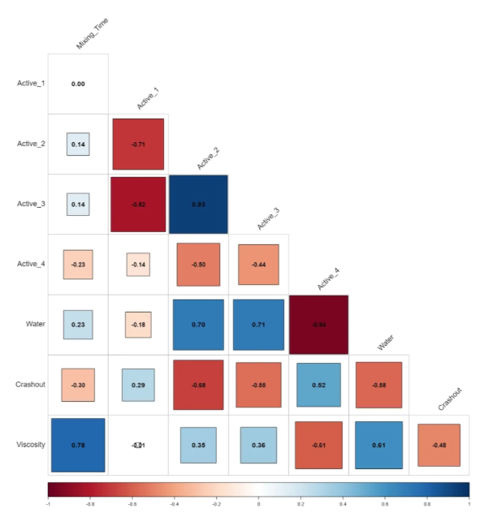

---

## Project Structure
```
formulation_dataset/
├── main.py                    # Entry point — runs the full analysis pipeline
├── files/
│   ├── model_training.py      # Model training, CV, scoring, residuals
│   ├── pca_transformation.py  # Scaling, PCA, explained variance
│   ├── outlier_removal.r      # IQR-based outlier removal (R)
│   └── exploratory_analysis.r # Correlation plots, boxplots (R)
├── csv_data_files/
│   ├── raw/                   # Original 100-formulation dataset
│   ├── interim/               # Post-outlier-removal (76 formulations)
│   └── processed/             # PCA-transformed data, accuracy scores, residuals
├── plot/                      # All saved PNGs (accuracy, residuals, EDA)
├── models/                    # Trained model .pkl files
└── environment.yml
```

---

## Usage

```python
from main import analysis

helper = analysis()

helper.view_outliers()           # Box plots of raw data outliers
helper.remove_outliers()         # IQR removal → saves interim CSV
helper.exploratory_analysis()    # Corrplot and EDA graphs
helper.pca_analysis()            # PCA transformation → saves processed CSV
helper.train_models()            # Train all 5 models × 7 feature sets
helper.graph_accuracy_residuals() # Accuracy bar chart + residual plots
```

---

## Setup

```bash
git clone https://github.com/reyrey112/formulation_dataset.git
cd formulation_dataset
conda env create -f environment.yml
conda activate formulation_dataset
python main.py
```

**Requirements:** Python 3.11, R 4.4.2, and the following R packages: `tidyverse`, `ggplot2`, `corrplot`

---

## Key Takeaways

- Gradient Boosting outperformed simpler regressors across most feature sets
- Forward Feature Selection identified a compact, high-performing subset without manual feature engineering
- The modeling framework is fully reusable — swap in a new CSV and the pipeline reruns end to end

---

## Outlook

This pipeline demonstrates how structured ML analysis can accelerate pharmaceutical DoE workflows. With a larger experimental dataset, the same framework supports:
- Predicting optimal formulation ratios before running experiments
- Identifying which raw materials most influence critical quality attributes
- Reducing the number of experiments needed to reach a target viscosity range
